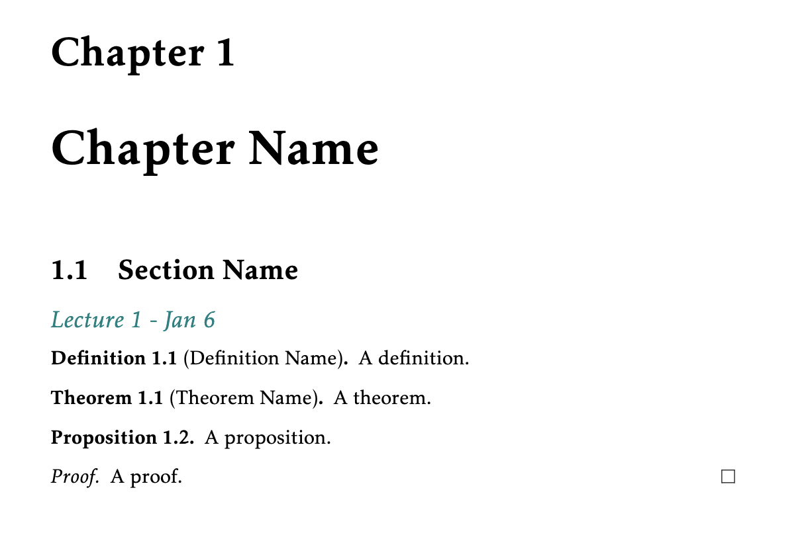

# My LaTeX Math Notes Template
My LaTeX template for math notes with stylized definitions, theorems and lemmas etc. from `tcolorbox`.

## Files
* `main.tex` - the main tex file
* `commands.tex` - for custom commands, e.g. `\newcommand{\ZZ}{\mathbb{Z}}`
* `theorems.tex` - definition of theorem boxes
* other-templates
  * `math-assignment-template.tex` - a minimal template for assignments
  * `minimal.tex` - a self-contained, minimal template for notes
 
|  |
|:--:|
|`minimal.tex`|
 

## References
* https://www.ctan.org/tex-archive/macros/latex/contrib/tcolorbox
* https://www.overleaf.com/latex/templates/math-notes-template/kfqdrzrzpvvk
